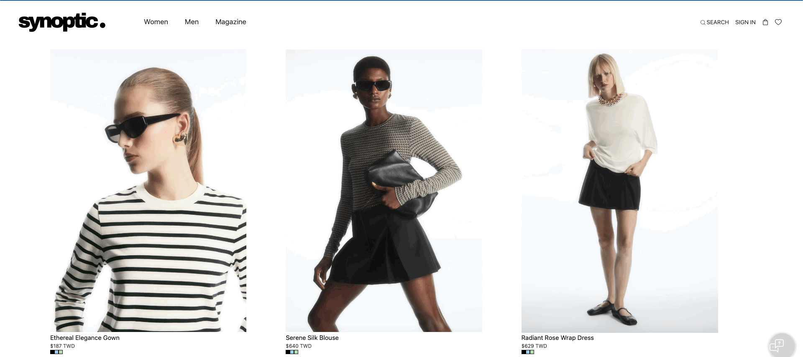

# Synoptic

## Project Goal
1. Website for online garment shopping
2. Provide chatbot for recommendation integrating openai and chatroom configuration

## Tech Stack
#### Frontend
- React, styled component, tailwind css
#### Backend
- Node.js, Python(openai)
#### Database
- Mysql, Redis
#### CICD
- github action, render
#### Development tools
- Docker, eslint, AWS


## Local Development
### Prerequiste: based on your setting, alter env config
```
cp .env.example .env

cd client
cp .env.example .env

cd server
cp .env.example .env
```

### Method1: docker-compose
```
docker-compose -f docker-compose.docker.yml up
```
### Method2: local terminal
```
docker-compose -f docker-compose.local.yml up -d
cd server
npm run develop-whole
```

## Showcase



